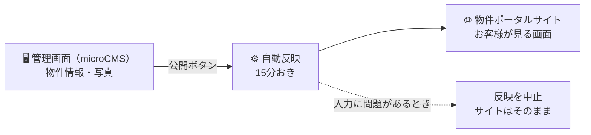

# REMAX COMPASS 物件ポータル 運用マニュアル

物件情報を更新する全員に向けたマニュアルです。パソコンの専門知識は必要ありません。

**まず、この2行だけ覚えてください。**

| やりたいこと | 使う場所 |
|---|---|
| 物件の追加・修正・写真の入れ替え | **管理画面**（microCMS） |
| サイトへの反映 | **「公開」ボタンを押すだけ**（最大15分で自動反映） |

**触る場所は管理画面ひとつだけです。** 他のツールを開く必要はありません。

---

## もくじ

1. [全体のしくみ](#1-全体のしくみ)
2. [最初の準備（初回だけ）](#2-最初の準備初回だけ)
3. [物件を新しく載せる](#3-物件を新しく載せる)
4. [物件の内容を直す](#4-物件の内容を直す)
5. [成約した・募集を止めるとき](#5-成約した募集を止めるとき)
6. [写真を入れる](#6-写真を入れる)
7. [入力項目 早見表](#7-入力項目-早見表)
8. [すぐに反映したいとき](#8-すぐに反映したいとき)
9. [うまくいかないとき](#9-うまくいかないとき)
10. [やってはいけないこと](#10-やってはいけないこと)
11. [広告のルール（宅建業法・表示規約）](#11-広告のルール宅建業法表示規約)
12. [用語集](#12-用語集)

---

## 1. 全体のしくみ

管理画面に入力して「公開」を押すと、自動でサイトが作り直されます。
**サイトを直接いじることはありません。**

### 安心していただきたいこと

**入力を間違えても、おかしな内容が公開されることはありません。**

問題があると自動反映は途中で止まり、サイトは**前の状態のまま**残ります。
そして管理担当者に「どの物件の何が問題か」が通知されます。
**壊す心配はないので、遠慮なく編集してください。**

---

## 2. 最初の準備（初回だけ）

管理担当者に、**普段お使いのメールアドレス**を伝えてください。
招待メールが届くので、そこからパスワードを設定すれば使えるようになります。

**作るアカウントはこれ1つだけです。** 他のサービスに登録する必要はありません。

---

## 3. 物件を新しく載せる

### 手順

1. 管理画面にログインする
2. 左のメニューから **「物件」** を選ぶ
3. 右上の **「追加」** を押す
4. フォームに入力する
5. 右上の **「公開」** を押す

**最大15分でサイトに出ます。** 15分おきに自動で確認しているためです。
急ぐときは → [8. すぐに反映したいとき](#8-すぐに反映したいとき)

### 入力するときのポイント

**① 選択肢は選ぶだけです**

物件種別・エリア・こだわり条件などは、**すべてプルダウンから選ぶ形**になっています。
手で打ち込む必要はないので、表記の揺れでエラーになることがありません。

**② 金額は数字だけ、円単位で入れます**

- ○ `480000`
- × `48万円` `480,000`

万単位で入れてしまうと「桁が少なすぎませんか」と警告が出ます。

**③ 所在地は番地・号まで書くと、地図が表示されます**

| 書き方 | 地図 |
|---|---|
| `東京都千代田区神田三崎町三丁目4番9号` | **出ます** |
| `東京都千代田区神田三崎町三丁目` | 出ません |

丁目までしか公開できない物件は、丁目までで大丈夫です。地図が出ないだけで、
他は問題なく掲載されます。

**④ 交通は「＋」を押して、駅ごとに追加します**

路線・駅・徒歩分をそれぞれの欄に入れます。複数の駅が使えるなら、
「＋」でいくつでも追加できます。

> **徒歩分数は道路距離80mを1分**として計算し、端数は切り上げます（表示規約）。

**⑤ 賃貸と売買で、使う欄が違います**

| 取引種別 | 入れる欄 | 空けておく欄 |
|---|---|---|
| **賃貸** | 月額賃料 / 共益費 / 敷金 / 礼金 / 契約期間 | 販売価格 / 表面利回り / 権利形態 |
| **売買** | 販売価格 / 表面利回り / 権利形態 / 用途地域 / 建ぺい率 / 容積率 | 月額賃料 / 共益費 / 敷金 / 礼金 / 契約期間 |

使わない側に入れてしまっても、警告が出るだけで無視されます。

**⑥ 「情報更新日」の欄はありません**

**公開した日時が自動で記録されます。** 更新日の入力忘れは起きません。

### まとめて何件も載せるとき（図面からの下書き）

1件ずつ管理画面に入れるのが大変なときは、**下書きページ**が使えます。

**https://property.lomets-inc.com/import.html**

社内用のページです。検索には出ませんが、URLを知っていれば誰でも開けるので、
**社外の方には教えないでください。**

#### 使いかた

1. 上のURLを開く
2. 左側に**図面のPDFを落とす**と、書かれている文字が取り出されます
   （手で貼り付けても構いません）
3. それを見ながら、右側のフォームに書き写す
4. 間違いがあれば**その場で赤く出ます**。直してから次へ進みます
5. **「一覧に追加」**を押す。同じ建物の別区画なら、物件番号と階数・面積だけ
   入れ直せば続けて追加できます
6. 全部入れ終わったら**「CSVを書き出す」**
7. 書き出したCSVを GitHub の `data/import/` に置き、
   Actionsの**「物件をCSVから一括登録」**を実行する
   （まず「確認だけ」で実行して、内容を見てから本番実行してください）
8. **登録が済んだら、`data/import/` に置いたCSVを削除する**

#### 気をつけること

- **PDFはこの画面の中だけで読み込まれます。** どこかへ送信されることはありません
- **図面から自動では書き写しません。** 文字を取り出して並べるところまでです。
  金額や面積は、必ずご自分の目で確かめて入力してください
- **画像として作られたPDF**（スキャンしたものなど）は文字を取り出せません。
  その場合は手で入力してください
- **交通は図面どおりの文章**で入れてください
  例）`JR山手線・埼京線「大崎」駅徒歩4分／都営浅草線「五反田」駅徒歩6分`
  「・」で並べた路線はそれぞれ1件として登録されます
- **写真はこの方法では登録できません。** 登録後に管理画面から入れてください
- **登録が済んだCSVは、`data/import/` から削除してください。**
  このリポジトリは公開されているため、置いたままだと
  `https://property.lomets-inc.com/data/import/ファイル名.csv` で誰でも読めます。
  仕入元からお預かりした資料を、そのまま残さないようにしてください

#### なぜ管理画面のCSV取り込みを使わないのか

管理画面のCSV取り込みでは、**「交通」のような繰り返しフィールドを登録できない**
ためです。このページとActionsを使う方法なら、交通も一緒に登録できます。

---

## 4. 物件の内容を直す

1. 管理画面で物件の一覧から、直したい物件を開く
2. 内容を書き換える
3. 右上の **「公開」** を押す

**日付の更新は不要です。** 公開した時点で自動的に更新日が変わります。

### 更新日が変わると起きること

| | 内容 |
|---|---|
| **新着バッジ** | 更新から**14日間**、サイトに「新着」マークが付きます |
| **取引条件の有効期限** | 更新の**14日後**が、自動で有効期限として表示されます |

有効期限の表示は、不動産の表示に関する公正競争規約で求められているものです。
**内容を直したら必ず「公開」を押してください。** 保存しただけでは反映されません。

---

## 5. 成約した・募集を止めるとき

### ❌ 物件を削除しないでください

### ✅ 「募集状況」を書き換えて「公開」を押してください

| 状況 | 「募集状況」で選ぶ値 | サイトでの見え方 |
|---|---|---|
| 募集中 | `募集中` | 検索結果に出ます |
| 商談が進んでいる | `商談中` | 検索結果に出ますが、新着バッジは付きません |
| 成約した | `成約済` | **検索結果から自動で消えます** |

管理画面に残しておくことで、後から「この物件はいくらで決まったか」を確認できます。
`成約済` にすれば、お客様には見えなくなります。

> **成約したら、その日のうちに `成約済` にしてください。**
> 成約済の物件を載せ続けることは、おとり広告として行政指導の対象になります。

---

## 6. 写真を入れる

**写真も同じ管理画面の中で入れます。** ファイル名を考える必要はありません。

### 手順

1. 物件の編集画面の **「写真」** の欄で「＋」を押す
2. **「写真」** に画像をドラッグ＆ドロップ（またはクリックして選択）
3. **「キャプション」** に「外観」「店内」などの説明を入れる（省略できます）
4. 複数入れる場合は「＋」でもう1件追加する
5. **「公開」** を押す

### ルール

- **一番上の写真がメイン画像**になります（一覧に出る写真）
- 順番は、写真の左の**ハンドルをドラッグして入れ替え**られます
- **1物件につき10枚まで**（11枚目以降は掲載されず、警告が出ます）
- キャプションは、サイトの写真の下に表示されます

> **写真のサイズは気にしなくて大丈夫です。**
> 大きすぎる写真は取り込むときに自動で縮小されます。
> スマホで撮ったそのままの写真をアップロードして問題ありません。

### 写真を消す・差し替える

その写真の行にある **ゴミ箱アイコン** で削除、画像をクリックして差し替えです。
**「公開」を押した時点で**、サイトからも消えます。

### 写真がない物件はどうなるか

物件種別に合わせたイメージ画像が自動で表示されます。
サイト上には「**この画像は物件種別に基づくイメージです**」と明記されるので、
誤解を招くことはありません。ただし、**問い合わせ数に直結するので写真は入れてください。**

---

## 7. 入力項目 早見表

| 欄 | 必須 | 書き方 | 例 |
|---|---|---|---|
| 物件番号 | **必須** | 他の物件と重複しない番号 | `CMP-1055` |
| 物件名 | **必須** | お客様に見える名前 | `神田三崎町 1階路面店舗` |
| 取引種別 | **必須** | 選ぶだけ | `賃貸` |
| 物件種別 | **必須** | 選ぶだけ | `店舗` |
| 募集状況 | | 選ぶだけ | `募集中` |
| エリア（市区） | **必須** | 選ぶだけ（83エリア） | `千代田区` |
| 所在地 | | **番地・号まで書くと地図が出ます** | `東京都千代田区神田三崎町三丁目4番9号` |
| 交通 | | 「＋」で駅ごとに追加 | 路線 `JR中央・総武線` / 駅 `水道橋` / 徒歩 `3` |
| 月額賃料（円） | **賃貸で必須** | 数字だけ | `480000` |
| 共益費（円） | | 数字だけ。無い場合は `0` | `35000` |
| 敷金（ヶ月） | | 月数の数字 | `10` |
| 礼金（ヶ月） | | 月数の数字。無い場合は `0` | `0` |
| 契約期間 | 賃貸は入れる | 文章でOK | `2年（定期借家）` |
| 販売価格（円） | **売買で必須** | 数字だけ | `980000000` |
| 表面利回り（%） | | 数字だけ | `4.2` |
| 権利形態 | | 空欄なら `所有権` になります | `所有権` |
| 用途地域 | 売買は入れる | | `商業地域` |
| 建ぺい率（%） | 売買は入れる | 数字だけ | `80` |
| 容積率（%） | 売買は入れる | 数字だけ | `500` |
| 私道負担 | 土地は入れる | `無` でも記載が必要です | `無` |
| 建築確認番号 | | | |
| 面積（坪） | **必須** | **坪**の数字。m²ではありません | `22.4` |
| 階数 | | 文字でOK | `1F` / `1F-8F` / `B1F` |
| 建物階数 | | 数字 | `8` |
| 築年月 | | **`年-月`の形**（月まで） | `1998-08` |
| 構造 | | | `SRC造` `S造` `RC造` |
| こだわり条件 | | 選ぶだけ（複数可・12種類） | `1階路面` `居抜き` |
| 用途 | | 選ぶだけ（複数可） | `飲食店` `物販` |
| 入居可能時期・引渡し時期 | | 文章でOK | `即入居可` / `2026年10月` / `相談` |
| 物件説明 | | 文章。長くて構いません | |
| 写真 | | 「＋」で追加。10枚まで | |

### 選択肢の一覧

**物件種別**（1つ選ぶ）

> 店舗 ／ オフィス ／ 倉庫・工場 ／ 一棟ビル ／ 事業用地

**募集状況**（1つ選ぶ）

> 募集中 ／ 商談中 ／ 成約済

**こだわり条件**（いくつでも選べます）

> 1階路面 ／ 居抜き ／ スケルトン ／ 飲食可 ／ 深夜営業可 ／ 24時間利用可 ／ 駐車場あり ／ 駅徒歩5分以内 ／ エレベーターあり ／ 空調更新済 ／ 看板設置可 ／ セットアップ

**エリア（市区）**（1つ選ぶ・全83件）

> 東京都 49件（23区＋多摩の26市）／神奈川県 12件／埼玉県 11件／千葉県 11件
>
> 一覧にない市区の物件は、管理担当者にご連絡ください。

### 「必須」の意味

**必須の欄が空だと、その物件は反映されません。**
（間違った情報が公開されるより安全なため、あえてそうしています。
サイトは前の状態のまま残るので、お客様に迷惑はかかりません。）

### 「入れる」の意味（必須ではないが、法令上求められる欄）

不動産の表示に関する公正競争規約で、表示が必要とされている項目です。
**空欄でも反映は通ります**が、そのままだと規約違反になります。

| 欄 | 空欄のとき |
|---|---|
| 契約期間（賃貸）／用途地域（売買）／私道負担（土地） | **警告が記録されます** |
| 建ぺい率・容積率（売買） | 警告は出ません。**気づけるのは人だけです。必ず入れてください** |

---

## 8. すぐに反映したいとき

通常は15分おきに自動で反映されます。**内見の直前など、すぐに出したいとき**は
手動で反映できます。

### 管理担当者の方へ

1. https://github.com/eiichiromukai-tech/ai-lp/actions を開く
2. 左の一覧から **「物件情報を反映（microCMS）」** を選ぶ
3. 右の **「Run workflow」** → 緑の **「Run workflow」**
4. **1〜2分**で反映されます

### 物件を登録する方へ

上の操作にはGitHubのアカウントが必要です。お持ちでない場合は、
**管理担当者に「◯◯をすぐ反映してほしい」とご連絡ください。**

急ぎでなければ、**そのまま15分お待ちいただければ自動で反映されます。**

> **なぜ「公開」と同時に反映されないのか**
> 管理画面から反映の仕組みを直接呼び出す方法もあるのですが、
> 途中に中継役のサービスを増やすことになり、その設定が切れると
> **エラーも出さずに反映が止まる**という壊れ方をします。
> 長く安定して動かすことを優先して、15分おきに見に行く方式にしています。

---

## 9. うまくいかないとき

### 「公開」を押したのにサイトに出ない

**まず15分待ってください。** 自動反映は15分おきなので、押した直後には出ません。
急ぐ場合は → [8. すぐに反映したいとき](#8-すぐに反映したいとき)

20分待っても出ない場合は、入力に問題があって反映が止まっています。
**管理担当者に「◯◯という物件が反映されません」とご連絡ください。**
どこが問題かを確認して直す手順が用意されています。

**サイトは前の状態のまま正常に動いていますので、慌てる必要はありません。**

### よくある原因

| 症状 | 原因と直しかた |
|---|---|
| 反映されない | **物件番号が他の物件と重複**しています。管理画面で番号を確認してください |
| 反映されない | **築年月**の書き方が違います。`2015-04` の形にしてください |
| 反映されない | 面積・賃料（売買なら価格）が**空欄**です |
| 写真が出ない | 「公開」を押していません。保存だけでは反映されません |
| 11枚目の写真が出ない | 1物件10枚までです。不要な写真を減らしてください |
| 検索結果に出ない | 募集状況が `成約済` になっています |

### 「保存」と「公開」の違い

| ボタン | 何が起きるか |
|---|---|
| **保存**（下書き保存） | 管理画面に残るだけ。**サイトには反映されません** |
| **公開** | サイトに反映されます |

**入力が終わったら必ず「公開」を押してください。**
書きかけのものは「保存」にしておけば、公開されません。

---

## 10. やってはいけないこと

### ❌ 物件を削除して成約を表す

削除ではなく、**募集状況を `成約済` に**してください（→ [5章](#5-成約した募集を止めるとき)）。
削除すると、後から成約実績を確認できなくなります。

### ❌ 未公開の情報を「物件説明」などに書く

**管理画面に入力した内容は、原則すべてサイトに公開されます。**

次のものは書かないでください。

- オーナー様・貸主様・売主様の氏名や連絡先
- 借主様・入居希望者様の氏名や連絡先
- 社内メモ（値下げの余地、売却のご事情、他社との競合状況）
- 手数料の配分や社内の利益に関する数字

公開前の物件を管理画面に入れる場合は、**「保存」だけにして「公開」を押さない**でください。
下書きのままならサイトには出ません。

### ❌ 物件番号を後から変える

物件番号はサイトのURLに使われています。変えると、
**以前に案内したリンクが開けなくなります**（お客様に送ったURLなど）。

### ❌ 管理画面の「API設定」を触る

入力フォームの定義です。ここを変えると全体の反映が止まります。
項目を増やしたい場合は管理担当者にご相談ください。

---

## 11. 広告のルール（宅建業法・表示規約）

**管理画面に入力した内容は、そのまま不動産広告になります。**
宅地建物取引業法と、不動産の表示に関する公正競争規約が適用されます。

### システムが自動でやってくれること

サイト側には、次の表示が**自動で入ります**。入力する必要はありません。

- 取引態様（宅建業法 第34条）
- 仲介手数料の説明（同 第46条）
- 情報提供元の会社名・免許番号
- 取引条件の有効期限（更新日から14日後を自動計算）
- 写真がない物件の「イメージ画像である」旨の注記
- 消費税の扱い

### 人が気をつけること

| 注意点 | 内容 |
|---|---|
| **おとり広告の禁止** | 実際に取引できない物件を載せない。成約したら速やかに `成約済` にする（宅建業法 第32条） |
| **最上級・断定表現の禁止** | 「完璧」「日本一」「格安」「掘り出し物」「最高」「絶対」などは使えません（表示規約） |
| **徒歩分数** | 道路距離80mを1分として計算し、端数は切り上げます |
| **築年月** | 年だけでなく**月まで**記載してください |
| **売買物件** | 用途地域・建ぺい率・容積率を記載してください |
| **土地** | 私道負担の有無を、負担が無い場合も `無` と記載してください |
| **賃貸物件** | 契約期間を記載してください |

---

## 12. 用語集

| 用語 | 意味 |
|---|---|
| **microCMS（マイクロシーエムエス）** | 物件情報を入力する管理画面のサービス名 |
| **公開** | サイトに反映するボタン。押さないと反映されません |
| **保存（下書き保存）** | 管理画面に残すだけ。サイトには出ません |
| **繰り返しフィールド** | 「＋」を押して何件でも追加できる欄（交通・写真） |
| **キャプション** | 写真の下に出る短い説明（「外観」など） |
| **新着バッジ** | 更新日から14日間、物件に付く「新着」マーク |
| **取引条件の有効期限** | 表示規約で必要な表示。更新日の14日後が自動で入ります |
| **自動反映** | 15分おきに管理画面を見に行き、変更があればサイトを作り直す仕組み |
| **Actions（アクションズ）** | 自動反映の実行記録。管理担当者がここで結果を確認します |

---

## よくある質問

**Q. 間違えて公開してしまいました**
A. 直して「公開」を押し直せば、次の反映で上書きされます。すぐ消したい場合は
   募集状況を `成約済` にするか、管理担当者に手動反映を依頼してください。

**Q. 下書きのまま置いておけますか**
A. できます。「保存」だけならサイトには出ません。公開が決まったときに
   「公開」を押してください。

**Q. 同じ物件を賃貸と売買の両方で出したい**
A. 物件番号を分けて、2件登録してください（例: `CMP-1055` と `CMP-1055S`）。

**Q. 写真を撮り直しました**
A. 古い写真をゴミ箱アイコンで消し、新しい写真を追加して「公開」。
   サイトの写真も次の反映で入れ替わります。

**Q. エリアの選択肢に載っていない市区の物件があります**
A. 管理担当者にご連絡ください。選択肢を増やす作業が必要です
   （管理画面だけでなくサイト側の設定も合わせる必要があります）。

---

## 困ったときは

このマニュアルで解決しない場合は、**自己判断で直さずに管理担当者へご連絡ください。**

**サイトが壊れる心配はありません。** 入力に問題があるときは、
システムが自動で反映を止めるようになっているためです。安心して編集してください。

---

管理担当者向けの資料: 導入手順は [docs/microcms-setup.md](docs/microcms-setup.md)、技術的な設定は [README.md](README.md) に記載しています。
