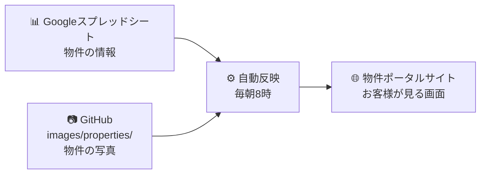

# REMAX COMPASS 物件ポータル 運用マニュアル

このサイトを更新する全員に向けたマニュアルです。パソコンの専門知識は必要ありません。

**まず、この3行だけ覚えてください。**

| やりたいこと | 使う場所 |
|---|---|
| 物件の情報を追加・修正する | **Googleスプレッドシート** |
| 物件の写真を追加・削除する | **GitHub**（ジットハブ） |
| サイトに反映する | **何もしなくて大丈夫**（毎朝8時に自動） |

---

## もくじ

1. [全体のしくみ](#1-全体のしくみ)
2. [最初の準備（初回だけ）](#2-最初の準備初回だけ)
3. [物件を新しく載せる](#3-物件を新しく載せる)
4. [物件の内容を直す](#4-物件の内容を直す)
5. [成約した・募集を止めるとき](#5-成約した募集を止めるとき)
6. [写真を追加する・差し替える・消す](#6-写真を追加する差し替える消す)
7. [急いで反映したいとき](#7-急いで反映したいとき)
8. [入力項目 早見表](#8-入力項目-早見表)
9. [うまくいかないとき](#9-うまくいかないとき)
10. [やってはいけないこと](#10-やってはいけないこと)
11. [広告のルール（宅建業法・表示規約）](#11-広告のルール宅建業法表示規約)
12. [用語集](#12-用語集)

---

## 1. 全体のしくみ

物件の情報は**スプレッドシート**に、写真は**GitHub**に置きます。
そこから自動でサイトが作られます。**サイトを直接いじることはありません。**



### 3つの場所の役割

| 場所 | 何を置くか | 誰が触るか |
|---|---|---|
| **Googleスプレッドシート** | 物件番号・賃料・面積・所在地など、文字と数字の情報すべて | 物件を担当する全員 |
| **GitHub** の `images/properties/` | 物件の写真だけ | 物件を担当する全員 |
| **サイト** | ここは自動で作られます | **誰も触りません** |

> **なぜ2か所に分かれているの？**
> スプレッドシートは文字と数字を扱うのが得意ですが、画像ファイルは置けません。
> そのため写真だけGitHubに置いています。どちらも「置くだけ」で反映されます。

---

## 2. 最初の準備（初回だけ）

### 2-1. スプレッドシートを開けるようにする

管理担当者に、**Googleアカウントのメールアドレス**を伝えてください。
「編集者」として招待されると、共有リンクから開けるようになります。

開いたら、**「⚠️はじめにお読みください」タブを必ず読んでください。**

### 2-2. GitHubを使えるようにする（写真を入れる人だけ）

1. https://github.com/ で無料アカウントを作る（メールアドレスだけで作れます）
2. アカウント名（ユーザー名）を管理担当者に伝える
3. 招待メールが届くので「Accept invitation」を押す

これで写真をアップロードできるようになります。**費用はかかりません。**

---

## 3. 物件を新しく載せる

### 手順

1. スプレッドシートの**物件データのタブ**を開く
2. 一番下の空いている行に、**左から順に**入力していく
3. 入力が終わったら、そのまま閉じる（保存ボタンはありません。自動保存です）

**翌朝8時に自動でサイトに載ります。** 急ぐ場合は → [7. 急いで反映したいとき](#7-急いで反映したいとき)

### 最低限これだけは必ず入れる項目

この6つ（＋金額）が空だと、**サイトは一切更新されません**。

| 項目 | 書き方 | 例 |
|---|---|---|
| 物件番号 | 他の物件と重複しない番号 | `CMP-1055` |
| 物件名 | お客様に見える名前 | `神田三崎町 1階路面店舗（居抜き）` |
| 物件種別 | 5つから選ぶ | `店舗` |
| エリア（市区） | 市区の名前 | `千代田区` |
| 面積(坪) | 数字だけ | `22.4` |
| 情報更新日 | 入力した日 | `2026-08-04` |
| 月額賃料(円)<br>または 販売価格(円) | 賃貸なら賃料、売買なら価格 | `480000` |

その他の項目の書き方は → [8. 入力項目 早見表](#8-入力項目-早見表)

### 入力するときのコツ

**① 既にある行をコピーすると早いです**

似た物件の行を選んでコピーし、下の行に貼り付けてから中身を書き換えると、
形式のミスがなくなります。**物件番号を変えるのを忘れないでください。**

**② 金額は「円」で、数字だけ入れます**

- ○ `480000`
- × `48万円` `480,000円`

万円で入れてしまうと「桁が少なすぎませんか」と警告が出ます。

**③ 所在地は番地・号まで書くと地図が出ます**

| 書き方 | 地図 |
|---|---|
| `東京都千代田区神田三崎町三丁目4番9号` | **出ます** |
| `東京都千代田区神田三崎町三丁目` | 出ません |

丁目までしか公開できない物件は、丁目までで大丈夫です。地図が出ないだけで、
他は問題なく掲載されます。

**④ 交通は `路線|駅|徒歩分` の形で、複数は `;` でつなぎます**

```
JR中央・総武線|水道橋|3;都営三田線|水道橋|5
```

この形で入れると、サイトの検索で「沿線から探す」「駅から探す」が使えるようになります。
縦棒（`|`）はキーボードの右上、`¥` や `\` と同じキーで打てます。

> **徒歩分数は道路距離80mを1分**として計算し、端数は切り上げます（表示規約）。

**⑤ こだわり条件・用途は `;` でつなぎます**

```
1階路面;居抜き;飲食可;看板設置可;駅徒歩5分以内
```

こだわり条件は**決められた12個の中から**選びます（それ以外を書くとエラーになります）。

> 1階路面 / 居抜き / スケルトン / 飲食可 / 深夜営業可 / 24時間利用可 /
> 駐車場あり / 駅徒歩5分以内 / エレベーターあり / 空調更新済 / 看板設置可 / セットアップ

**⑥ 賃貸と売買で、使う列が違います**

| 取引種別 | 使う列 | 空けておく列 |
|---|---|---|
| **賃貸** | 月額賃料 / 共益費 / 敷金 / 礼金 / 契約期間 | 販売価格 / 表面利回り / 権利形態 |
| **売買** | 販売価格 / 表面利回り / 権利形態 / 用途地域 / 建ぺい率 / 容積率 | 月額賃料 / 共益費 / 敷金 / 礼金 / 契約期間 |

使わない側に入れてしまっても、警告が出るだけで無視されます。

---

## 4. 物件の内容を直す

1. スプレッドシートで該当の行を探す（物件番号で探すのが確実です）
2. 直したいセルを書き換える
3. **「情報更新日」を今日の日付に更新する** ← これを忘れないでください

### なぜ「情報更新日」が大事なのか

この日付が2つのことを決めています。

| 使われ方 | 内容 |
|---|---|
| **新着バッジ** | 情報更新日から**14日間**、サイトに「新着」マークが付きます |
| **取引条件の有効期限** | 情報更新日の**14日後**が、自動で有効期限として表示されます |

有効期限の表示は、不動産の表示に関する公正競争規約で求められているものです。
**日付を更新しないと「古い条件のまま」と受け取られる可能性があります。**

---

## 5. 成約した・募集を止めるとき

### ❌ 行を削除しないでください

### ✅ 「募集状況」を書き換えてください

| 状況 | 「募集状況」に入れる値 | サイトでの見え方 |
|---|---|---|
| 募集中 | `募集中` | 検索結果に出ます |
| 商談が進んでいる | `商談中` | 検索結果に出ますが、新着バッジは付きません |
| 成約した | `成約済` | **検索結果から自動で消えます** |

行を残しておくことで、後から「この物件はいくらで決まったか」を確認できます。
`成約済` にすれば、お客様には見えなくなります。

---

## 6. 写真を追加する・差し替える・消す

写真は**スプレッドシートではなくGitHub**に置きます。

### 6-1. ファイル名のつけかた（これが一番大事です）

```
物件番号 - 番号 _ キャプション . 拡張子
```

**例：**

| ファイル名 | 意味 |
|---|---|
| `CMP-1025-01_外観.jpg` | CMP-1025 の1枚目。写真の下に「外観」と表示されます |
| `CMP-1025-02_店内.jpg` | 2枚目。「店内」と表示 |
| `CMP-1025-03.jpg` | 3枚目。キャプションなし（`_` 以降は省略できます） |

**ルール**

- **番号が一番小さい写真がメイン画像**になります（一覧に出る写真）
- 番号順に並びます。`01` `02` `03`… と2桁で揃えると管理しやすいです
- **1物件につき10枚まで**（11枚目以降は掲載されず、警告が出ます）
- 拡張子は `jpg` `jpeg` `png` `webp` `avif` `gif` が使えます
- ファイル名の物件番号が、スプレッドシートの物件番号と**一致していないと掲載されません**

> **写真のサイズは気にしなくて大丈夫です。**
> 大きすぎる写真は、取り込むときに自動で長辺1600ピクセルに縮小されます。
> スマホで撮ったそのままの写真をアップロードして問題ありません。

### 6-2. 写真を追加する

1. GitHubで `images/properties/` フォルダを開く
2. 右上の **「Add file」→「Upload files」** を押す
3. 写真をドラッグ＆ドロップする（複数まとめてOK）
4. 下までスクロールして **「Commit changes」** を押す

**数十秒後にはサイトに出ます。** 待つ必要はありません。

### 6-3. 写真を差し替える

**同じファイル名**で新しい写真をアップロードすると、上書きされます。

### 6-4. 写真を消す

1. GitHubで消したい写真のファイルをクリックして開く
2. 右上の **ゴミ箱アイコン** を押す
3. 下の **「Commit changes」** を押す

### 6-5. 写真がない物件はどうなるか

物件種別に合わせたイメージ画像が自動で表示されます。
サイト上には「**この画像は物件種別に基づくイメージです**」と明記されるので、
誤解を招くことはありません。ただし、**問い合わせ数に直結するので写真は入れてください。**

---

## 7. 急いで反映したいとき

通常は毎朝8時に自動反映されますが、すぐ反映したい場合は手動で実行できます。

1. GitHubのリポジトリを開く
2. 上部の **「Actions」** タブを押す
3. 左側の一覧から **「スプレッドシートを反映」** を選ぶ
4. 右側の **「Run workflow」** ボタン →  もう一度 **「Run workflow」**
5. 1〜2分待つ。緑のチェック ✅ が付けば完了です

**赤い ✕ が付いた場合**は入力に問題があります。→ [9. うまくいかないとき](#9-うまくいかないとき)

> **写真だけを追加した場合、この操作は不要です。** アップロードした時点で自動的に反映されます。

---

## 8. 入力項目 早見表

スプレッドシートの列を、左から順に並べています。

| # | 列名 | 必須 | 書き方 | 例 |
|---|---|---|---|---|
| 1 | 物件番号 | **必須** | 他と重複しない番号 | `CMP-1055` |
| 2 | 物件名 | **必須** | お客様に見える名前 | `神田三崎町 1階路面店舗` |
| 3 | 取引種別 | | `賃貸` / `売買`（空欄なら賃貸） | `賃貸` |
| 4 | 物件種別 | **必須** | `店舗` `オフィス` `倉庫・工場` `一棟ビル` `事業用地` | `店舗` |
| 5 | 募集状況 | | `募集中` / `商談中` / `成約済` | `募集中` |
| 6 | 都県 | | `東京都` `神奈川県` `埼玉県` `千葉県` | `東京都` |
| 7 | エリア（市区） | **必須** | 市区名（決められた83エリアから） | `千代田区` |
| 8 | 所在地 | | **番地・号まで書くと地図が出ます** | `東京都千代田区神田三崎町三丁目4番9号` |
| 9 | 交通 | | `路線\|駅\|徒歩分` を `;` 区切り | `JR中央・総武線\|水道橋\|3` |
| 10 | 月額賃料(円) | **賃貸で必須** | 数字だけ（円単位） | `480000` |
| 11 | 共益費(円) | | 数字だけ。無い場合は `0` | `35000` |
| 12 | 敷金(ヶ月) | | 月数の数字 | `10` |
| 13 | 礼金(ヶ月) | | 月数の数字。無い場合は `0` | `0` |
| 14 | 販売価格(円) | **売買で必須** | 数字だけ（円単位） | `980000000` |
| 15 | 表面利回り(%) | | 数字だけ | `4.2` |
| 16 | 権利形態 | | 空欄なら `所有権` になります | `所有権` |
| 17 | 契約期間 | 賃貸は入れる | 文章でOK | `2年（定期借家）` |
| 18 | 面積(坪) | **必須** | **坪**の数字。m²ではありません | `22.4` |
| 19 | 階数 | | 文字でOK | `1F` / `1F-8F` / `B1F` |
| 20 | 建物階数 | | 数字 | `8` |
| 21 | 築年月 | | **年-月**の形（月まで） | `1998-08` |
| 22 | 構造 | | | `SRC造` `S造` `RC造` |
| 23 | 用途地域 | 売買は入れる | | `商業地域` |
| 24 | 建ぺい率(%) | 売買は入れる | 数字だけ | `80` |
| 25 | 容積率(%) | 売買は入れる | 数字だけ | `500` |
| 26 | 私道負担 | 土地は入れる | `無` でも記載が必要です | `無` |
| 27 | 建築確認番号 | | | |
| 28 | こだわり条件 | | 決められた12個から `;` 区切り | `1階路面;居抜き;飲食可` |
| 29 | 用途 | | 自由。`;` 区切り | `飲食店;物販;サービス` |
| 30 | 入居可能時期・引渡し時期 | | 文章でOK | `即入居可` / `2026年10月` / `相談` |
| 31 | 情報更新日 | **必須** | `2026-08-04` の形 | `2026-08-04` |
| 32 | 物件説明 | | 文章。長くて構いません | |

### 「必須」の意味

**必須の項目が空だと、その日はサイトが一切更新されません。**
（間違った情報が公開されるより安全なため、あえてそうしています。
サイトは前日のまま残るので、お客様に迷惑はかかりません。）

### 「入れる」の意味（必須ではないが、法令上求められる項目）

不動産の表示に関する公正競争規約で、表示が必要とされている項目です。
**空欄でも取り込みは通ります**が、そのままだと規約違反になります。

| 項目 | 空欄のとき |
|---|---|
| 契約期間（賃貸）／用途地域（売買）／私道負担（土地） | **警告が記録されます** |
| 建ぺい率・容積率（売買） | 警告は出ません。**気づけるのは人だけです。必ず入れてください** |

---

## 9. うまくいかないとき

### 「Actions」に赤い ✕ が付いた

**焦らなくて大丈夫です。サイトは前日のまま、正常に動いています。**
間違った情報が公開されることはありません。

原因の調べかた：

1. GitHubの **「Actions」** タブを開く
2. 赤い ✕ が付いた実行を押す
3. **「スプレッドシートと写真を取り込んで反映」** を押す
4. **どの行の何が悪いか、日本語で書いてあります**

例：
```
エラー: [15行目] エリア（市区）「渋谷」はマスタにありません
エラー: [23行目] 情報更新日は必須です（2026-07-30 のように入力してください）
```

スプレッドシートの該当行を直して、[7. 急いで反映したいとき](#7-急いで反映したいとき)
の手順でもう一度実行すれば完了です。

### よくあるエラーと直しかた

| エラーの内容 | 原因と直しかた |
|---|---|
| `エリア（市区）「◯◯」はマスタにありません` | 市区名が違います。`渋谷` ではなく **`渋谷区`** のように、正式名称で入れてください |
| `情報更新日は必須です` | 空欄です。今日の日付を入れてください |
| `物件番号「◯◯」が重複しています` | 行をコピーしたときに番号を変え忘れています |
| `都県「◯◯」とエリア「◯◯」が一致しません` | 行をコピーしたときに、都県かエリアの片方だけ直しています。両方合わせてください |
| `こだわり条件「◯◯」はマスタにありません` | 決められた12個以外を書いています。表記の揺れ（`駅近` など）もエラーになります |
| `交通◯件目「◯◯」の形式が不正です` | `路線\|駅\|徒歩分` の縦棒が足りないか、全角になっています |
| `築年月「◯◯」の形式が不正です` | `2015-04` の形にしてください |
| `見出し行が想定と異なります` | **1行目を書き換えてしまっています。** 元に戻してください（→ [10章](#10-やってはいけないこと)） |

### 写真をアップロードしたのにサイトに出ない

次の順に確認してください。

1. **ファイル名の物件番号は合っていますか？**
   スプレッドシートの物件番号と1文字でも違うと掲載されません（大文字小文字も含めて）
2. **ファイル名が `物件番号-番号.jpg` の形になっていますか？**
   物件番号と番号の間はハイフン（`-`）です。アンダーバー（`_`）ではありません
3. **すでに10枚入っていませんか？** 番号の若い順に10枚だけ掲載されます
4. **その物件は `成約済` になっていませんか？** 成約済は検索結果に出ません

### スプレッドシートを直したのにサイトが変わらない

- **朝8時をまだ過ぎていないだけ**かもしれません → [7章](#7-急いで反映したいとき)で手動実行してください
- **「Actions」に赤い ✕ が付いていないか**確認してください

---

## 10. やってはいけないこと

### ❌ 1行目（見出し行）を書き換える・列を増やす・並べ替える

システムは1行目を見て、どの列が何かを判断しています。
ここを変えると**取り込みが完全に止まります**。

列を増やしたい場合は、管理担当者にご相談ください（システム側の修正が必要です）。

### ❌ 物件データのタブに、注意書きなどの行を足す

1行が1物件として読み取られます。メモを残したい場合は**別のタブ**に書いてください。

### ❌ 未公開の情報をスプレッドシートに書く

**このスプレッドシートの中身は、実質的に公開されているとお考えください。**

サイトの管理をGitHubという公開の場所で行っており、スプレッドシートのURLも
そこに記載されているため、社外の人でも見ようと思えば見られる状態です。

**書いてはいけないもの：**

- 公開前・未公開の物件
- オーナー様・貸主様・売主様の氏名や連絡先
- 借主様・入居希望者様の氏名や連絡先
- 社内メモ（値下げの余地、売却のご事情、他社との競合状況）
- 手数料の配分や社内の利益に関する数字

未公開物件を管理したい場合は、**別のスプレッドシート**（社内メンバーのみ共有）を作り、
公開が決まったものだけをこちらに転記してください。

### ❌ サイトのファイル（HTML・JavaScript）を直接編集する

`data/properties.js` などは**自動で作られるファイル**です。
直接編集しても、次の自動反映で上書きされて消えます。

写真以外は、**必ずスプレッドシートから**変更してください。

---

## 11. 広告のルール（宅建業法・表示規約）

**スプレッドシートに書いた内容は、そのまま不動産広告になります。**
宅地建物取引業法と、不動産の表示に関する公正競争規約が適用されます。

### システムが自動でやってくれること

サイト側には、次の表示が**自動で入ります**。入力する必要はありません。

- 取引態様（宅建業法 第34条）
- 仲介手数料の説明（同 第46条）
- 情報提供元の会社名・免許番号
- 取引条件の有効期限（情報更新日から14日後を自動計算）
- 写真がない物件の「イメージ画像である」旨の注記
- 消費税の扱い

### 人が気をつけること

| 注意点 | 内容 |
|---|---|
| **おとり広告の禁止** | 実際に取引できない物件を載せない。成約したら速やかに `成約済` にする（宅建業法 第32条） |
| **最上級・断定表現の禁止** | 「完璧」「日本一」「格安」「掘り出し物」「最高」「絶対」などは使えません（表示規約） |
| **徒歩分数** | 道路距離80mを1分として計算し、端数は切り上げます |
| **築年月** | 年だけでなく**月まで**記載してください |
| **売買物件** | 用途地域・建ぺい率・容積率を記載してください |
| **土地** | 私道負担の有無を、負担が無い場合も `無` と記載してください |
| **賃貸物件** | 契約期間を記載してください |

> **「成約したら速やかに」が特に重要です。**
> 成約済の物件を載せ続けることは、おとり広告として行政指導の対象になります。
> 成約が決まったら、その日のうちに `成約済` にしてください。

---

## 12. 用語集

| 用語 | 意味 |
|---|---|
| **GitHub（ギットハブ）** | サイトのファイルを保管している場所。ここに写真を置きます |
| **リポジトリ** | GitHub上の、このサイト専用の保管場所のこと |
| **Actions（アクションズ）** | 自動反映の作業記録が見られるタブ。エラーもここで確認します |
| **Commit changes（コミット チェンジズ）** | 「この変更を確定する」ボタン。押さないと反映されません |
| **Upload files** | ファイルをアップロードするボタン |
| **自動反映（同期）** | スプレッドシートと写真を読み取って、サイトを作り直す処理 |
| **新着バッジ** | 情報更新日から14日間、物件に付く「新着」マーク |
| **取引条件の有効期限** | 表示規約で必要な表示。情報更新日の14日後が自動で入ります |
| **マスタ** | あらかじめ決められた選択肢のこと（物件種別・エリア・こだわり条件） |

---

## 困ったときは

このマニュアルで解決しない場合は、**自己判断で直さずに管理担当者へご連絡ください。**
特に1行目（見出し行）を触ってしまった場合は、そのままご連絡ください。

**サイトが壊れる心配はほとんどありません。** 入力に問題があるときは、
システムが自動で反映を止めるようになっているためです。安心して編集してください。

---

<sub>技術的な設定（公開URL・問い合わせ先・自動反映の設定など）は `README.md` に記載しています。</sub>
